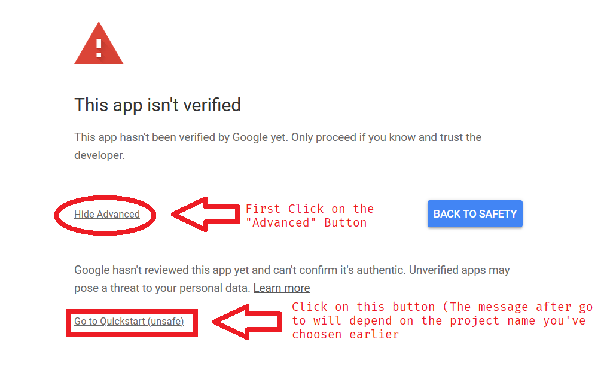
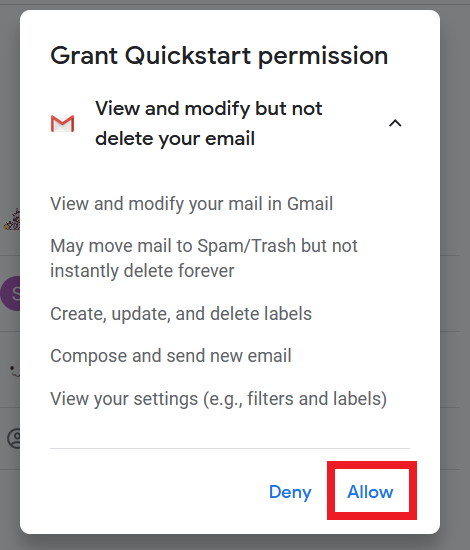
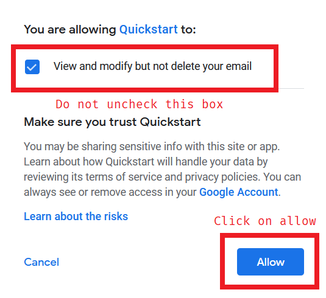

### About program configuration

#### First Time Running
Some parameter is asked when you run the program for the first time.

To be specific, the path to `credentials.json` and path to **Store** `token.pickle` is requested
- What is `credentials.json` and how to configure it
  - `credentials.json` is a file google generates when you first enabled the Gmail API
  - If you do not have one, please referrer to `SETUP INSTRUCTIONS.pdf` Steps 1-5 to generate a `credentials.json`
  - If you already have a `credentials.json`, please get the **Absolute path** to `credentials.json` and enter it to the program.
    - **NOTE: When Entering the path. Please make sure there is no quotes (\") surrounding the path**
    - Please Referrer to [this](https://www.top-password.com/blog/copy-full-path-of-a-folder-file-in-windows/) page if you don't know how to get an absolute path of a file
- What is `token.pickle` and how to configure it
  - `token.pickle` is a file to store then authorization information after authorizing the app to use the email information
  - If you don't have `token.pickle`, don't panic, this file is generated by the program and you are not expected to create one
  - To configure `token.pickle` question during setup, simple press enter without entering any value to use the default path (stores same place as your exe file)
  - 

Responding the Logger settings
- If you don't know what it means. Simply press enter without enter any value to use the default values

#### Granting Access Authorization
If it's the first time you've ran the program or after you close to delete the token.pickle. A web page will popup which asks you to login to your accounts
- by picking an account. You are giving this program (And the API key you've generated) Access to the account's gmail data and it's read/write access
  - List of granted access
    - View and modify your mail in Gmail
    - May move mail to Spam/Trash but not instantly delete forever
    - Create, update, and delete labels
    - Compose and send new email
    - View your settings (e.g., filters and labels)

Encountered "This app isn't verified?"
- This warning occurred because the account you used to generate your `credentials.json` is not the same one as the account to you are choosing right now
- This warning can be resolved by either generating `credentials.json` again with the account you are choosing right now, or, allowing the access anyways
  - To regenerate `credentials.json` Repeat steps 1-5 in SETUP INSTRUCTIONS.pdf with your chosen account
  - To bypass the warning follow the below image
    - 
    - 
    - 
  - After the steps, you should see the page that says
    - > The authentication flow has completed. You may close this window.

#### Running the Redirector
- There are few parameters the user has to provide before starting the operation.
  - Q: *How many email to fetch per request*
    - The amount of emails to look through to find the email that will be forwarding
  - Q: *What's the email's subject should be*
    - What should the email subject be (This setting is matched by regular expression)
    - The default expression is 'Score released:'
      - You can findout the details about above expression or play around with other expression [here](http://regexr.com/5d9e4)
  - Q: *What's the Email To should be*
    - What should the email be sent to
  - Q: *What's the before date*
    - Only search email that were sent before this date
    - Date should be in YYYY/MM/DD format Strictly
    - Try it in your Gmail search bar with "before:"
  - Q: *What's the after date*
    - Only search email that were sent after this date
    - Date should be in YYYY/MM/DD format Strictly
    - Try it in your Gmail search bar with "after:"
  - Q: *What's the domain to be replaced*
    - When retargeting the receiver. which part of the domain should be replaced
  - Q: *What should the original domain be replaced with*
    - When retargeting the receiver. What should the replaced part be replaced with
