## This file is for setting up, to see how to use the program. go to CONFIG INSTRUCTIONS.pdf

### Step 1
#### Go to: https://developers.google.com/gmail/api/quickstart/python
##### You should see this

### Step 2
#### Click on Enable Gmail API
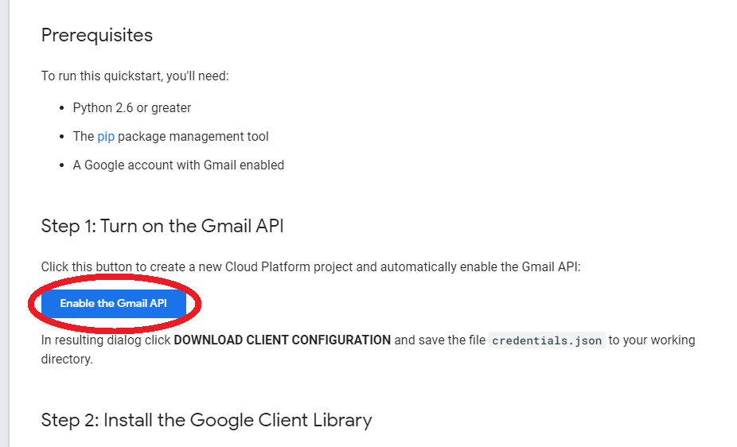

### Step 3
#### Enter the project name
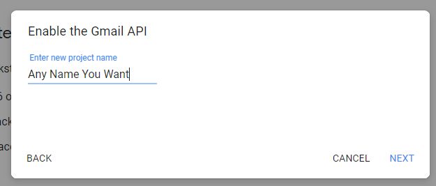

### Step 4
#### Chose Desktop App
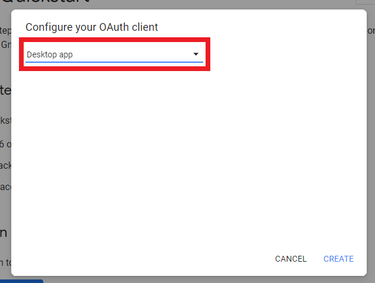

### Step 5
#### Download the configuration (Note: This file is very important, keep it secure)
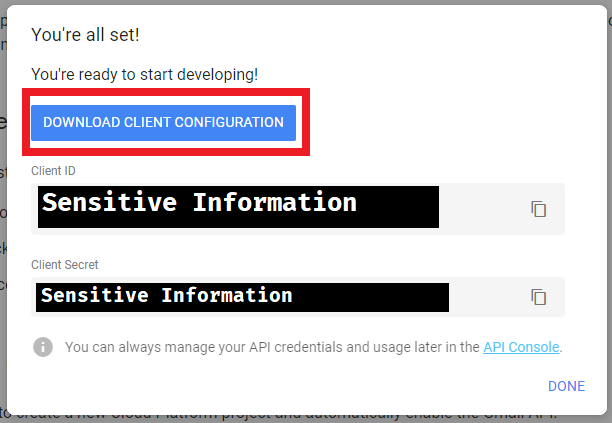

### Step 6
#### Go to: https://github.com/sqz269/GoogleFormReturnRedirector
##### Now there is two ways of doing this. One by directly downloading a compiled executable from release page (Which I have not done) or download the python environment and execute the script directly using python
##### Step 6-12 is for directly executing the script, skip to Step 13 for downloading an executable

### Step 7
#### Download the source code
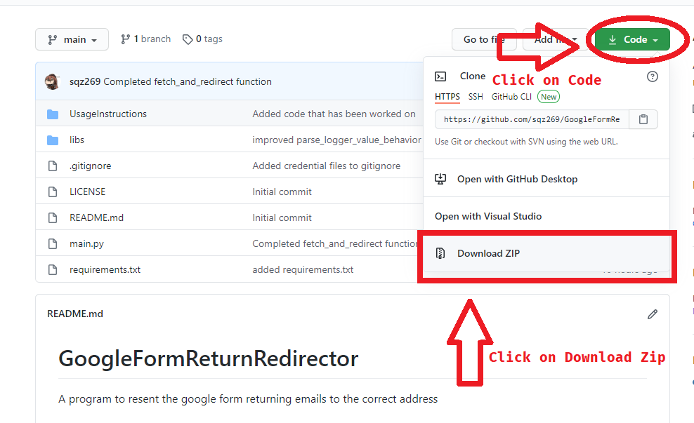

### Step 8
#### Extract the source code
##### NOTE: Exact extraction procedures depends on your system. 
##### Usually windows 10 will have a *Extract* option when your right click on the folder, but it will depend

### Step ⑨
#### Download python
##### Go to python.org
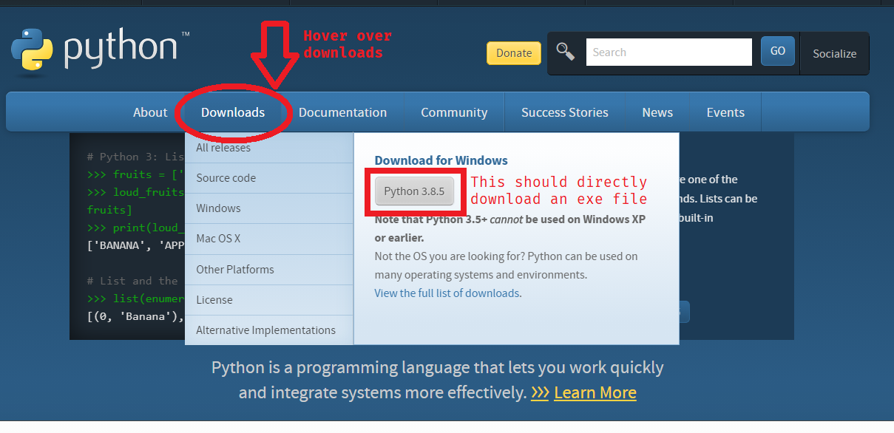

### Step 10
#### Install python
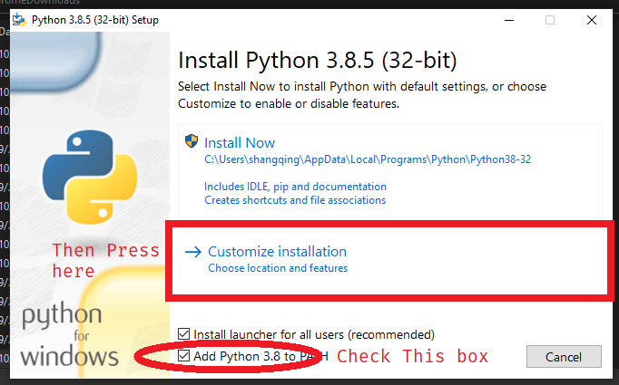
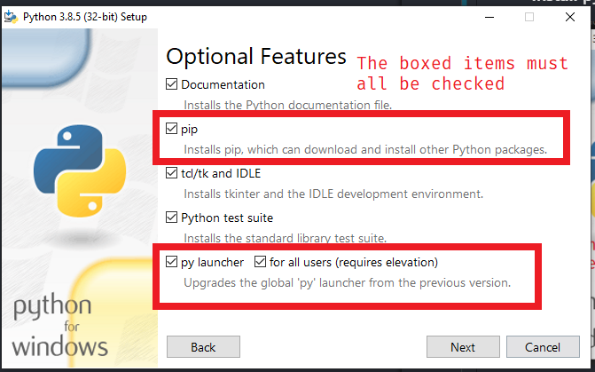
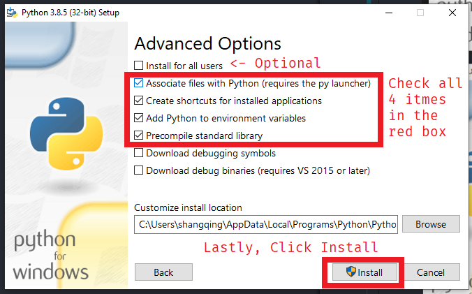

### Step 11
#### Installing to required packages
##### Navigate to the folder with the source code
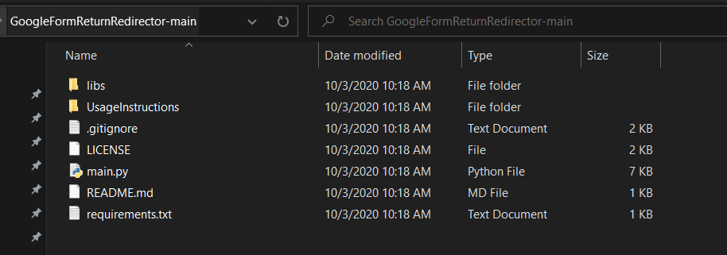

##### Hold *Shift* And Right Click On the folder window and you should see following window (Or something like that)
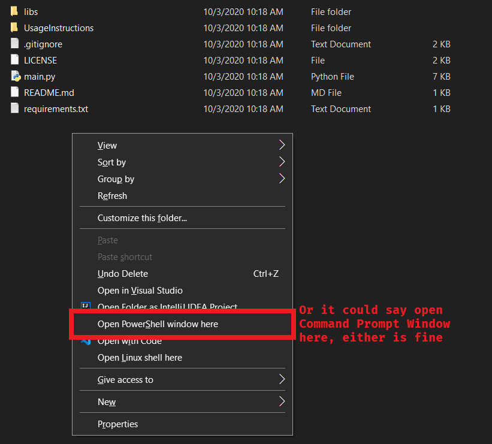
#### Click on Open PowerShell window here (or command Prompt window)
#### You should now see a black/blue window pop up.
#### Now Enter the following command
`pip install -r .\requirements.txt --user`
#### Wait till it finishes installing, Do not interrupt the process

### Step 12
#### To execute the script, simply type in the Blue/Black window `py main.py`

---

### Step 13
#### NOTE: If you did step 7 - 12, Disregard the following steps
#### Go to: https://github.com/sqz269/GoogleFormReturnRedirector/releases
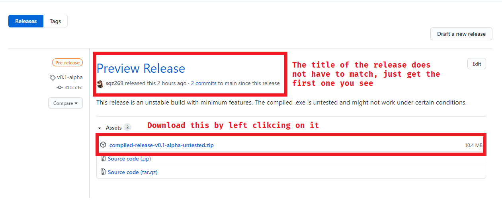
#### You might see this message. just click on the arrow and keep
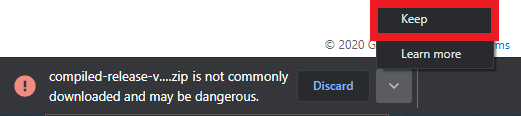

### Step 14
#### Extract the downloaded zip file
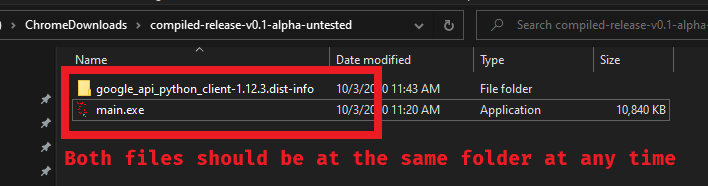

### Step 15
#### You are done, just run `main.exe` if you need to use it
